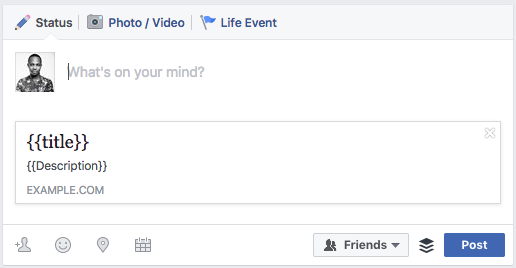

## `Ionic`中调用`nightmare`库

1. 新建`angular2 ionic`应用

2. 通过`angular universal`库来完成`angular2`服务端的开发，服务端的代码运行，一定要依赖于`web`服务器环境？直接用`node`来启动或执行`angular uninversal`应用不可以？不可以，这个`universal`依赖于服务器执行环境

3. 通过按钮调用`nightmare`来执行特定的操作

   > 通过按钮来调用`nightmare`，听上去不错，问题来了，`nightmare`是否支持在浏览器环境下运行？`nightmare`就是一个`web`引擎

   遇到问题：`nightmare`是一个库，它并不能在浏览器环境下直接运行，准确的说，它可以在后台环境中运行，如`node`命令行环境，或者`server`端服务器环境。所以想成功调用`nightmare`并执行，就需要一个类似于`node`这样的宿主环境来执行，`ionic`和`electron`宿主环境是否满足这样的执行要求呢？

   > 目前正在研究中，发现把`nightmare`的包`import`到`ionic`项目中时，编译报错，提示`Uncaught Error: Cannot find module "debug"`，难道说`ionic`这样的宿主环境不能执行`nightmare` ？希望能够找到比较好的解决方案

4. ~~目前可能可行的解决方案：通过`electron`加载`ionic`，`ionic`中调用`nightmare`，`ionic`的`app`不要通过`angular`来写，用纯`javascript`来编写`ionic`应用。[参考文档](https://www.raymondcamden.com/2015/07/23/some-initial-thoughts-on-building-desktop-apps-with-ionic-and-electron)~~

5. 通过服务端和客户端的方式来配置即可，服务端采用`node`下的`express`，客户端技术随便选择，`ionic`或者`electron`都行

## `ionic`的app转换成`electron`类型的app

[参考文档](https://blog.thecodecampus.de/setup-ionic-2-electron-typescript-angular2/)

## 在`Electron`中调用`nightmare`方法

[参考文档](https://github.com/segmentio/nightmare/issues/856)

## `angular2`客户端技术解析

`ng2`的客户端技术其实是虚拟`dom`技术，通过浏览器的`view-source`功能只能看到`angualr2`的容器节点，其他组件内容都看不到内容，这就是虚拟`dom`技术

#### 虚拟`dom`技术弊端

1. 不利于`seo`的抓取内容索引，他们获取到的`dom`内容都是不完整的页面，说明[参考文档](https://scotch.io/tutorials/server-side-rendering-in-angular-2-with-angular-universal#toc-what-is-universal)
2. 分享你的文章链接的时候，很可能出现下面的情况，无法获取到分享内容

## `angular2`写服务端的应用

使用`angular2`写服务端应用的目的是为了解决上面`angular2`应用在客户端应用时出现的一些弊端，参照上面的说明，可以实现对`seo`友好，使用的到的是`angular2`的一个库`Agular Universal`

1. `Server-Side Rendering in Angular 2 with Angular Universal`[参考文档](https://scotch.io/tutorials/server-side-rendering-in-angular-2-with-angular-universal)

## 写法

1. 采用`api`的形式来访问，选择存在明显的的问题，服务的部署问题，在`pc`端还好，能直接部署服务，如果通过`ionic`部署到移动端，那么访问服务的问题，如何解决？